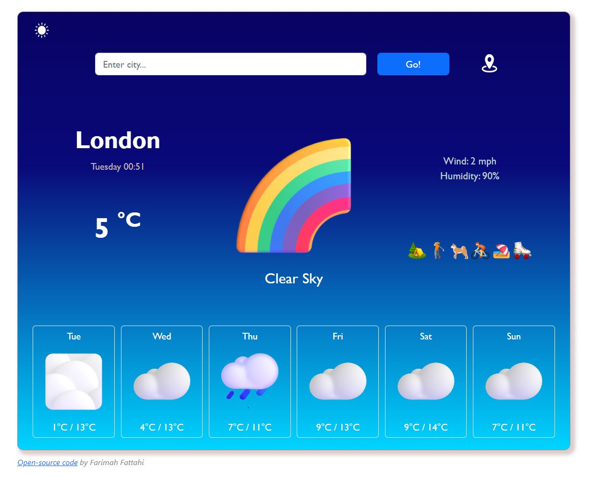
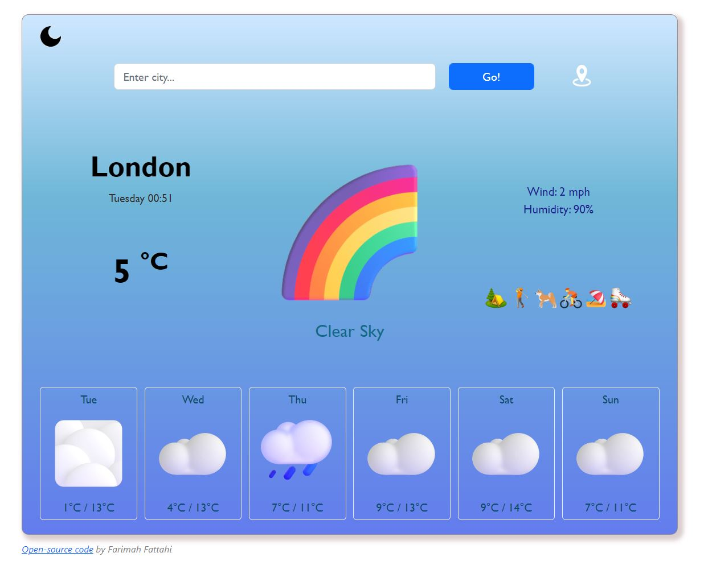
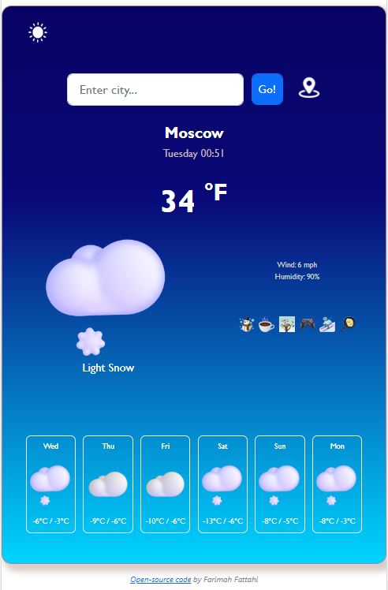
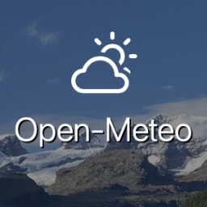
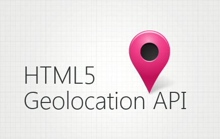

# Weather App :partly_sunny:

A web application for checking current and future days weather conditions. 

## Features

- Light/dark mode toggle

- City searching

- Current location option

- Current tempreture and some more info(weather description, wind speed, humidity)

- 6-day weather tempreture forecast

- Weather hobbies according to the climate

- Degree convertion(C° to F° and vice versa)

## Table of contents

- [Weather App :partly_sunny:](#weather-app--partly-sunny-)
  * [Features](#features)
  * [Table of contents](#table-of-contents)
  * [Demo](#demo)
  * [Screenshots](#screenshots)
  * [Packages](#packages)
  * [Style](#style)
  * [API Reference](#api-reference)
      - [Get current weather data by city name](#get-current-weather-data-by-city-name)
      - [Get current weather data by latitude and longitude](#get-current-weather-data-by-latitude-and-longitude)
      - [Get forecast weather data](#get-forecast-weather-data)
      - [Get user's current location](#get-users-current-location)
  * [Badges](#badges)
  * [Contributing](#contributing)
  * [Feedback](#feedback)

## Demo

https://my-weather-app-22.netlify.app/
## Screenshots

#### Desktop view(dark mode):

  <div align="center">


  
  </div>
  
  #

#### Desktop view(light mode):

  <div align="center">


  
  </div>
  
  #

#### Mobile view:

  <div align="center">


  
  </div>

## Packages

These packages are used in this project:

- Axios
- Bootstrap
## Style
2 types of styles were used in the project:

- CSS3
- Bootstrap


## API Reference

Axios is a promise-based HTTP client for the browser and node.js. In this project Axios is used to access the APIs.

3 APIs were used:
- OpenWeatherMap (For current weather data)
- Open-Meteo (For forecast weather data)
- HTML Geolocation API (For Locating user's position)


```diff
! In order to connect to or communicate with an API, an API_key is necessary.
```


**1. OpenWeatherMap:**
  <div align="center">


  
  </div>

OpenWeatherMap is an online service, owned by OpenWeather Ltd, that provides global weather data via API. It allows access current weather data for any location on Earth including over 200,000 cities!

It collects and processes weather data from different sources such as global and local weather models, satellites, radars and a vast network of weather stations.

API URL: https://openweathermap.org/api

#### Get current weather data by city name

```http
  GET https://api.openweathermap.org/data/2.5/weather?q={city_name}&appid={API_key}
```

| Parameter | Type     | Description                |
| :-------- | :------- | :------------------------- |
|`city_name`| `string` | **Required**. Name of the city to fetch  |
| `API_key` | `string` | **Required**. Your API key |

#### Get current weather data by latitude and longitude

```http
  GET https://api.openweathermap.org/data/2.5/weather?lat={lat}&lon={lon}&appid={API_Key}&units={unit}
```

| Parameter | Type     | Description                |
| :-------- | :------- | :------------------------- |
|`lat, lon` | `string` | **Required**. latitude and longitude of the position.  |
| `API_key` | `string` | **Required**. Your API key |
|`units`    | `string` | Units of measurement.      |

<details><summary><h5>API response(Expand to see)<h5></summary>
  
```http
{
  "coord": {
    "lon": 10.99,
    "lat": 44.34
  },
  "weather": [
    {
      "id": 501,
      "main": "Rain",
      "description": "moderate rain",
      "icon": "10d"
    }
  ],
  "base": "stations",
  "main": {
    "temp": 298.48,
    "feels_like": 298.74,
    "temp_min": 297.56,
    "temp_max": 300.05,
    "pressure": 1015,
    "humidity": 64,
    "sea_level": 1015,
    "grnd_level": 933
  },
  "visibility": 10000,
  "wind": {
    "speed": 0.62,
    "deg": 349,
    "gust": 1.18
  },
  "timezone": 7200,
  "id": 3163858,
  "name": "Zocca",
  "cod": 200
}                                               
```
  </details>
  
  
**2. Open-Meteo:**
  
<div align="center">
  

      
  </div>

Open-Meteo is an open-source weather API with free access for non-commercial use. No API key is required. You can use it immediately!

API URL: https://open-meteo.com/en/docs

#### Get forecast weather data

```http
  GET https://api.open-meteo.com/v1/forecast?latitude={lat}&longitude={lon}&daily=weathercode,temperature_2m_max,temperature_2m_min&timezone=auto
```

| Parameter | Type     | Description                       |
| :-------- | :------- | :-------------------------------- |
|`latitude, longitude` | `string` | **Required**. Latitude and longitude of the position.|
| `daily`   | variable | weathercode, temperature_2m_max, temperature_2m_min |
|`timezone` | value    | auto |

<details><summary><h5>API response(Expand to see)<h5></summary>
  
```http
{
"data": {
    "latitude": 51.5,
    "longitude": -0.120000124,
    "generationtime_ms": 1.2079477310180664,
    "utc_offset_seconds": 0,
    "timezone": "Europe/London",
    "timezone_abbreviation": "GMT",
    "elevation": 23,
    "daily_units": {
        "time": "iso8601",
        "weathercode": "wmo code",
        "temperature_2m_max": "°C",
        "temperature_2m_min": "°C"
    },
    "daily": {
        "time": [
            "2023-02-16",
            "2023-02-17",
            "2023-02-18",
            "2023-02-19",
            "2023-02-20",
            "2023-02-21",
            "2023-02-22"
        ],
        "weathercode": [
            61,
            3,
            3,
            3,
            3,
            3,
            3
        ],
        "temperature_2m_max": [
            13.6,
            14.2,
            14.5,
            13,
            13.8,
            14.4,
            9.2
        ],
        "temperature_2m_min": [
            8.3,
            10.2,
            9.4,
            6.8,
            7.8,
            8,
            3.2
        ]
    }
}
```
  </details>
  
  **3. HTML Geolocation API:**

  <div align="center">
    

    
  </div>

The HTML Geolocation API is used to get the geographical position of a user. Since this can compromise privacy, the position is not available unless the user approves it.

#### Get user's current location

```
  navigator.geolocation.getCurrentPosition({Function name})
```

| Parameter | Type     | Description                |
| :-------- | :------- | :------------------------- |
|`Function name`| Function as parameter | **Required**. Function outputs the latitude and longitude   |

*The getCurrentPosition() method is used to return the user's position.* :globe_with_meridians:

For more information please follow this [link](https://developer.mozilla.org/en-US/docs/Web/API/Geolocation/getCurrentPosition).

## Badges


[](https://choosealicense.com/licenses/mit/)


## Contributing

Contributions are always welcome! :seedling:

I would warmly welcome your contributions to this project if you think you can optimize or add some new features to it.


## Feedback

If you have any feedback, please feel free to reach out to me at farimah.fattahi2000@gmail.com. :email:

Please let me know if you enjoyed this app by staring it! :star:
